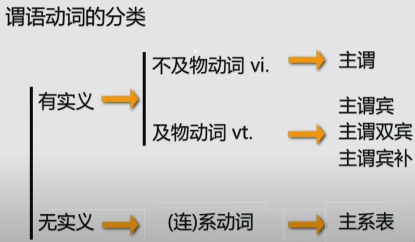

# Chapter1
+ 语法 = 连词成句
+ 考句子 = 考语法
+ words  -->  chunks  --> sentences
  
## 第一部分 如何表达一件事
#### 第一讲 简单句的核心构成

+ 简单句  n. + v.   主语 + 谓语动词  1对1

+ 主谓双宾
  - I bought you a present.
  - I bought a present for you
  - **for表目的（为谁），to表方向(给谁)**
  - They offered me a vacant post
  - They offered a vacant post to me
+ 主谓宾补(宾语**是**什么)
  - I find HongKong beautiful（beautiful补充说明HongKong)
  - I find HongKong a good place for shopping
+ 主系表
    >系动词：
    >>be动词(单独出现)
    >>get become trun  go grow “变得”
    >>look sound smell taste feel  感官动词 “看/听/闻/尝/感觉起来
    >>keep remain / seem appear

#### 第二讲 简单句的核心变化（谓语动词的时态/情态/语态）
#### 第三讲 简单句的扩展（形容词/副词/介词短语）
#### 第四讲 简单句的提升（非谓语动词）
#### 第五讲 简单句的综合运用

## 第二部分 如何表达多件事（连接词）
#### 第六讲 并列句
#### 第七讲 复合句---名词性从句
#### 第八讲 复合句---定语从句
#### 第九讲 复合句---状语从句

## 第三部分 如何解决特殊句式和长难句
#### 第十讲 特殊结构 --- 分裂结构/平行结构
#### 第十一讲 特殊句式 --- 虚拟/倒装/强调
#### 第十二讲 长难句的综合运用