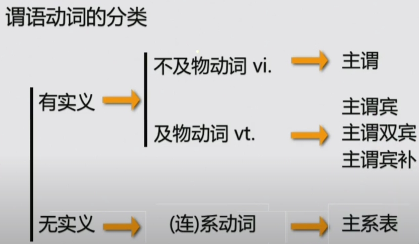
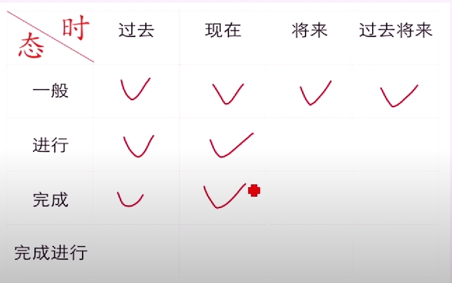
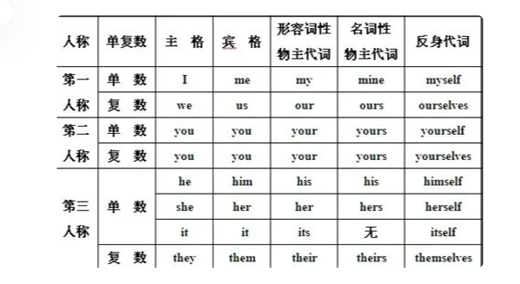
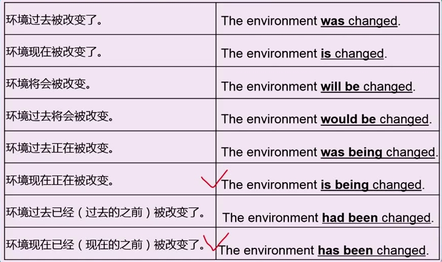

+ 语法 = 连词成句
+ 考句子 = 考语法
+ words  -->  chunks  --> sentences
  
# 第一部分 如何表达一件事
## 第一讲 简单句的核心构成

+ 简单句  n. + v.   主语 + 谓语动词  1对1

+ 主谓双宾
  - I bought you a present.
  - I bought a present for you
  - **for表目的（为谁），to表方向(给谁)**
  - They offered me a vacant post
  - They offered a vacant post to me
+ 主谓宾补(宾语**是**什么)
  - I find HongKong beautiful（beautiful补充说明HongKong)
  - I find HongKong a good place for shopping
+ 主系表
    >系动词：
    >>be动词(单独出现)
    >>get become trun  go grow “变得”
    >>look sound smell taste feel  感官动词 “看/听/闻/尝/感觉起来
    >>keep remain / seem appear

## 第二讲 简单句的核心变化（谓语动词的时态/语态/情态/否定）
### 一. 时态
+ 什么时态
  - 描述动作的时间和状态
+ 怎么表达时态
+ 时态种类 (8种常用)

#### 1. 一般过去时，*表示完全发生在过去的事*
+ 形式： V.  动词过去式 (did)
>例句
>> She was busy last week
#### 2.一般现在时
+ 用法
  + **表示动态的经常性习惯性的事**
  + **表示静态的现在的状态**
  + **表示永恒**
+ 形式：V.动词原形/V.动词第三人称单数(do/does)
+ 使用三单形式谓语的主语有：he、she、it、可数名词单数、不可数名词
>
>| **当主语是第三人称单数时，谓语动词的变化规则**  | **示例动词（原形）** | **第三人称单数形式** |
>|----------------------------------|----------------------|-----------------------|
>| 一般规则：加 `-s`                | play                 | plays                 |
>| 以 `-ch`、`-sh`、`-s`、`-x`、`-z` 结尾的动词，加 `-es` | watch                | watches               |
>| 以辅音字母 + `-y` 结尾，变 `y` 为 `i`，再加 `-es` | study                | studies               |
>| 以元音字母 + `-y` 结尾的动词，直接加 `-s` | play                 | plays                 |
>| 以 `-o` 结尾的动词，加 `-es`      | go                   | goes                  |
>| 特殊不规则变化动词                | have                 | has                   |
>| 不规则动词，不变化                | put                  | puts                  |

>例句
>> He often gets up late
>> The change is not always voluntary
>> Peter doesn't play tennis at weekends

#### 3. 一般将来时，表示现在的将来
+ 形式
  + will （not）+ do原形
  + am/is/are (not) going to + do原形
  + shall + do原形，只能用于I 或 we做主语

#### 4. 过去将来时，站在过去看将来,一定会伴随过去时的上下文出现
+ 形式
  + would + do原形
  + was/were going to +do原形
>例句
>>Tony finished his work, and then he would leave for London
>>When I was young, I would be cooker

#### 5.过去/现在/将来进行时，强调正在、持续进行的事
+ 形式
  + am/is/are + doing 现在进行时
  + was/were + doing 过去进行时
  + will be + doing 将来进行时
>例句
>>He was preparing for university
>>Brick by brick, six-year-old Alice is building a magical kingdom
>>A great many candidates will be meeting here at this time tommorrow
>>I was watching TV when you called me.

#### 6. 现在完成时，站在现在，回头看之前发生的事，是否完成不重要
+ 形式： have/has + done(过去分词)
+ 现在完成时中，全部完成的事情，可以换成一般过去时表示
+ 现在完成时中，没有全部完成的事情，不能换成一般过去时表示
>例句
>>He has finished his homework    （已完成）
>>We have learned English since 1998  (不一定全部完成)
>>We have lived here since 1992

#### 7. 现在完成进行时，现在的之前发生的事，强调正在、持续、反复进行
+ 形式： have/has been doing(现在分词)
>例句
>>the global economy has been expanding at a bit over 3% a year

#### 8. 过去完成时，站在过去，回头看之前发生的事，是否完成不重要
+ 形式： had + done(过去分词)
+ 通常上下文伴随着一般过去时一起使用
>例句
>>When he got there, she had left.
>>Before the meeting started,he had finished all the preparation

### 二. 语态（主动语态、被动语态）
#### 1. 被动语态的用途
+ 当不知道动作的发出者时，只能写成被动的
+ 特意强调被谁做的时，被动+by
+ 表达观点看法时，突出客观事实时，最好写成被动

#### 2. 被动语态的构成
+ 形式： be + done（过去分词）
  + be: 被动的时间
  + done: 被动的动作
  + 主语的单复数
>例句
>>The environment here was changed.

#### 3. 被动语态与时态结合

>例句
>>International commerce was therefore dominated by raw materials
>>This representation has commonly been limited to guest experiences

#### 4. 被动语态与情态结合
+ 情态动词后面动词用原形
>例句
>>The environment here must be changed
>>The environment here can be changed
>>The environment here may be changed
>>The environment here should be changed

### 三. 情态

## 第三讲 简单句的扩展（形容词/副词/介词短语）

### 介词短语
+ 介词 prep.
  + in on at by off from with without about
+ 形式：介词 + 名词/代词/doing = 介词短语   介宾结构
+ 介词短语是句子的扩展或补充，永远是非核心

#### 表示地点的介词
|介词|含义|说明|
|:---:|:---|:--|
|at/in|在...地点/在...里面|at表示在某个点,in表示在里面|
|on,above,over/under,below|在...上面/下面|on在表示有接触的上面，above、over表示在上方，over表示在垂直上方|
|in front of/behind|在...之前/之后|
|near,by,beside|在...旁边|
|between,among|在...之间|between在两者之间，among在三者及以上之间|
|around|在...周围|
|into/out of|进入...里面/从...出去|in是静态的，into是动态的|
|onto/off|到...上面/脱离...|on是静态的，onto是动态的|
|across,through/past|穿过.../经过...|across在表面上方过去，through在里面过去，past从旁边经过没有接触|
|along|沿着...|
|from/to|来自.../朝着...去|

> at表示在某个点，一维的空间
> on表示在平面的上方，二维的空间
> in表示在立体的里面，三维的空间

#### 表示时间的介词
|介词|含义|说明|
|:---:|:---|:--|
|at/on/in|在...时间点/时间上/时间内|in时间点, on某一天，in时间范围（年月周等）|
|before/after|在...时间之前/之后|
|from,since|自从...时间|
|by,until|截止到(直到)...时间|
|for|持续...时间|
|during|在...期间|during this week|

#### 其它用法的介词
|介词|含义|说明|
|:---:|:---|:--|
|of|...的...（表示属性）|a gril of seventeen 17岁的女孩, A of B = B's A |
|about|关于...|
|with/without|伴随着有.../没有...|
|for|为了...（表示目的）|I do it for you|
||因为...（表示原因）|for this reason|
||对于...（表示对象）|for you English is very important|
|by|通过...方式或方法|by bike. We can win the competition by working hard|
||被...做（被动语态+by+动作的发出者）||
||相差了...(表示变化的差额)|the population increased by ten percent |
|as|作为...|as a teacher I should work hard to teach you better and better|
||像...一样,如同...|I have the same habits as you|
|like|像...一样|like this.  you look like your farther|
|despite|尽管...|although是连词，despite是介词|

> A of B of C, The window of the door of the classroom 教室的门的窗户

## 第四讲 简单句的提升（非谓语动词）
## 第五讲 简单句的综合运用

# 第二部分 如何表达多件事（连接词）
## 第六讲 并列句
## 第七讲 复合句---名词性从句
## 第八讲 复合句---定语从句
## 第九讲 复合句---状语从句

# 第三部分 如何解决特殊句式和长难句
## 第十讲 特殊结构 --- 分裂结构/平行结构
## 第十一讲 特殊句式 --- 虚拟/倒装/强调
## 第十二讲 长难句的综合运用