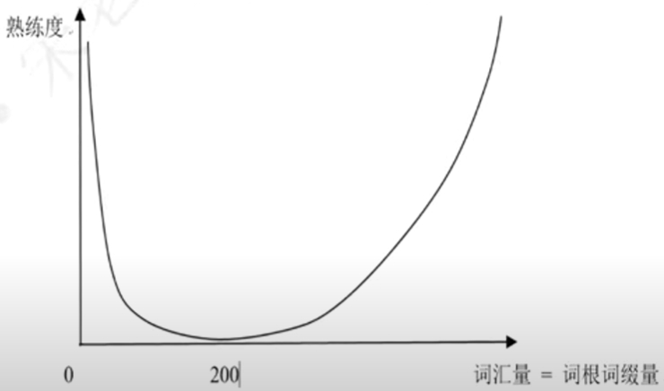

# 速记方法 
## 一、英语词汇速记曲线

## 构词法
### 1. 词根：单词的本意
+ 前缀：表强调或方向
+ 后缀：表词性，偶尔表含义
+ 音变：
  + 中文玩“变形”，英文玩“变音” 
  + 中文: 甲、申、由【含义完全不同】
  + 英文：-vinc- = -vict- 胜利，征服【含义相同】
+ 元音
  + 元音字母：a e i o u 
  + 单元音：y w
  + 功能：连字符，最常用的i,u,无意义
+ 辅音: 发音相似，可替换
